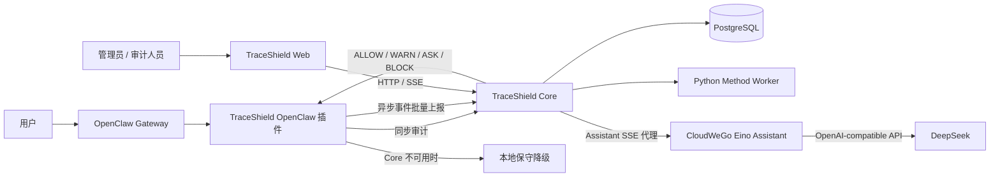

# TraceShield 项目介绍

TraceShield 是面向 Agent 工具调用的运行时安全审计系统。它将 OpenClaw 的消息、模型交互和工具调用接入统一审计链路，在工具真正执行前给出同步安全决策，在执行后持续记录可查询、可追溯的事件证据。

项目的核心目标不是替代 Agent 平台，而是在 Agent 与高风险工具之间提供一个可观测、可阻断、可降级的安全层。

## 解决的问题

Agent 具备文件读写、Shell、网络请求和外部消息发送能力后，风险不仅来自单次命令，还来自多步上下文中的组合行为。TraceShield 处理以下问题：

- 在工具调用前识别敏感文件读取、破坏性命令和外部网络访问。
- 把允许、告警、审批和阻断结果转换为 OpenClaw 可以执行的运行时行为。
- 记录消息、工具调用、工具结果和决策证据，供控制台、审计人员和后续分析查询。
- 当中心 Core 短暂不可用时，对高风险行为保持 fail-closed 的本地降级策略。
- 将运行时方法引擎与传统规则策略并行运行，支持评估、影子模式和逐步强化执行。

## 系统架构



运行时有两条关键链路：

1. **同步控制链路**：插件在 `before_tool_call` 中调用 Core 的 `POST /v1/audit/tool-call`。Core 返回 `ALLOW`、`WARN`、`ASK` 或 `BLOCK`，插件据此放行、提示、请求审批或拒绝工具调用。
2. **异步证据链路**：插件把消息、模型输入输出、工具结果与降级决策转换为事件，批量发送到 `POST /v1/events/batch`。Core 将其持久化并通过 SSE 推送给 Web 控制台。

同步链路优先保证安全与低延迟；异步链路优先保证可观测性与最终可追溯性。两者都不应把完整敏感原文默认写入审计数据。

## 核心决策模型

| 决策 | 含义 | 当前典型场景 |
| --- | --- | --- |
| `ALLOW` | 允许继续执行 | 普通只读文件访问 |
| `WARN` | 允许但标记风险 | 未知工具或中等风险操作 |
| `ASK` | 需要显式审批 | `rm -rf`、`mkfs`、外部网络请求 |
| `BLOCK` | 拒绝执行 | `.env`、私钥等敏感文件读取 |

基础策略是确定性的：敏感文件读取直接阻断，破坏性 Shell 命令和外部请求进入审批，其他低风险调用默认放行。策略的证据、命中规则和风险等级会随决策一起保存。

### Core 不可用时的行为

插件默认启用 `fallback_enabled=true`。在 Core 超时、网络失败或返回异常时：

- 高风险工具类别，例如 `shell_exec`、`file_write`、`file_delete` 和 `network_request`，默认阻断。
- 低风险只读工具只有命中本地允许缓存时才可放行。
- 未知工具请求审批；不存在审批能力时默认阻断。
- 所有降级决策都会生成 `fallback_decision` 事件，以便后续审计。

因此，Core 的故障不会把系统变成默认放行状态。

## 模块职责

| 模块 | 技术与职责 | 是否有网络端口 |
| --- | --- | --- |
| `openclaw-plugin/` | TypeScript OpenClaw 插件；注册 Hook、进行同步审计、异步上报、脱敏与本地降级 | 否，随 Gateway 运行 |
| `core/` | Fastify + PostgreSQL Core；提供审计、事件、查询、SSE、证据链和方法引擎接口 | `8787` |
| `core/method-engine/` | Python JSON Lines Worker；计算运行时方法结果和风险图 | 否，由 Core 管理 |
| `assistant-eino/` | Go + CloudWeGo Eino；通过 DeepSeek 提供只读安全分析对话和流式输出 | `8790`，仅本机 |
| `web/` | Vue 3 + Vite 审计控制台；展示会话、工具调用、风险图和实时事件 | `5173` |
| `docker-compose.yml` | PostgreSQL 16 开发/联调数据库 | `5432` |
| `deploy/systemd/` | Core 与 Web 的用户级 systemd 服务定义 | 否 |

`mock-core/` 是早期无数据库演示服务，不是当前完整链路的一部分。不要在真实 Core 已占用 `8787` 时再启动它。

## Core 与方法引擎

Core 是系统的权威审计服务，负责：

- PostgreSQL 迁移、策略和审计证据持久化。
- 同步审计决策与异步事件去重、提取。
- 会话、运行、工具调用、风险图和证据路径查询。
- SSE 实时事件流。
- 启动和管理本地 Python 方法引擎 Worker。

方法引擎有三种模式：

| 模式 | 行为 |
| --- | --- |
| `legacy` | 只使用 TypeScript 基础策略，不启动方法 Worker。 |
| `shadow` | 基础策略决定执行；方法引擎只记录建议和评估结果。 |
| `enforce` | 方法建议参与执行决策，但仍受安全底线约束；Worker 故障会退回基础策略。 |

默认配置是 `shadow`。方法 Worker 通过 stdin/stdout 与 Core 通信，不开放额外端口。它的 Python 虚拟环境预期位于 `core/method-engine/.venv`。

## 插件与 OpenClaw

插件在 Gateway 启动时加载，关键能力包括：

- `before_tool_call`：执行前同步审计。
- `after_tool_call`：上报工具结果。
- 消息和模型事件采集：构建会话证据链。
- `agentToolResultMiddleware`：为阻断和审批结果提供可见反馈。
- `traceshield_status`：供 OpenClaw 侧查询插件状态。

Gateway 与插件配置位于用户目录的 `~/.openclaw/openclaw.json`，不属于仓库，也不应提交 token、模型 API key 或真实机器路径。插件应保持对同机 Core 的 `http://127.0.0.1:8787` 调用，即使 Core 也对局域网监听。

## Web 控制台

Web 控制台默认入口是 `/runtime`，主要展示：

- 当前运行状态、近 24 小时指标与实时连接状态。
- 会话和运行列表。
- 工具调用、策略命中、决策详情和审批信息。
- 风险图、证据路径与会话摘要。
- Core 的 SSE 实时事件流。

当 `VITE_USE_MOCK_DATA=false` 时，前端使用真实 Core。未显式配置 `VITE_TRACESHIELD_CORE_BASE_URL` 时，前端会使用当前浏览器主机名加端口 `8787`，因此局域网访问 Web 时会请求同一台虚拟机的 Core。

## 数据与隐私边界

TraceShield 默认遵守最小采集原则：

- 参数、结果与消息优先保存摘要、预览、哈希和必要资源提示。
- `TRACESHIELD_SAVE_RAW_PAYLOAD`、`TRACESHIELD_SAVE_RAW_PARAMS` 和 `TRACESHIELD_SAVE_RAW_RESULT` 默认均为 `false`。
- 查询和 SSE 接口不应返回原始敏感参数或完整事件载荷。
- 异步上报失败时，插件先使用内存队列，必要时使用磁盘队列并在 Core 恢复后幂等补传。

Core 和 Web 目前可监听局域网接口，PostgreSQL Compose 也映射 `5432`。部署到非隔离网络前，必须使用主机防火墙、反向代理或私网策略限制访问来源；不要将这些端口直接暴露到公网。

## 端口与访问入口

| 服务 | 端口 | 本机入口 | 局域网入口 |
| --- | --- | --- | --- |
| PostgreSQL | `5432` | `127.0.0.1:5432` | 不建议直接对外使用 |
| Eino Assistant | `8790` | `http://127.0.0.1:8790/health` | 不对局域网开放 |
| TraceShield Core | `8787` | `http://127.0.0.1:8787/v1/health` | `http://<VM_IP>:8787/v1/health` |
| TraceShield Web | `5173` | `http://127.0.0.1:5173/runtime` | `http://<VM_IP>:5173/runtime` |
| OpenClaw Gateway | `18789` | `http://127.0.0.1:18789` | `http://<VM_IP>:18789`，需要 Gateway token |

在当前 VMware 环境中，虚拟机地址可通过 `hostname -I` 获取。不要将某个 DHCP 地址硬编码为项目配置。

## Eino 的位置

当前仓库使用独立的 Go 服务接入 CloudWeGo Eino，并通过 Eino 的 ChatModel 组件调用 DeepSeek。Web 不直连该服务，而是由 Core 的 `/v1/assistant/*` 接口代理健康查询和 SSE 对话流。

第一阶段 Eino Assistant 不注册任何工具，只用于解释审计决策、风险路径和调查建议。它不参与插件与 Core 的同步安全门；Eino 或模型服务不可用时，工具调用的实时阻断和 fail-closed 降级仍照常工作。

## 验证范围

当前仓库提供以下验证入口：

```bash
# Core HTTP、数据库、策略、事件与查询冒烟测试
npm --prefix core run smoke

# Core 单元测试和方法引擎测试
npm --prefix core run test
npm --prefix core run method:test
npm --prefix core run method:health

# 插件类型、单元测试、构建及真实 Core 联调
npm --prefix openclaw-plugin run typecheck
npm --prefix openclaw-plugin run test
npm --prefix openclaw-plugin run build
npm --prefix openclaw-plugin run demo:core

# Web 类型、构建和 smoke 检查
npm --prefix web run typecheck
npm --prefix web run build
npm --prefix web run smoke
```

完整、可重复执行的启动流程见 [RUNBOOK.md](RUNBOOK.md)。模块级 API、契约和方法文档索引见 [doc/README.md](doc/README.md)。
