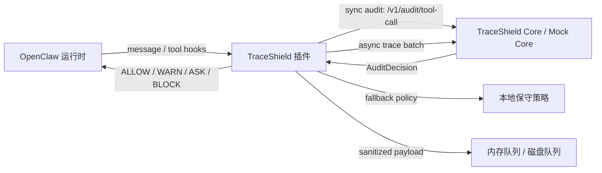

# TraceShield OpenClaw 插件

TraceShield OpenClaw 插件是一个运行时安全门，用来在 OpenClaw 执行工具调用和事件采集时做同步审计、异步留痕、脱敏处理和本地降级。仓库里同时包含一个用于演示和联调的 Mock Core，用来模拟 TraceShield Core 的 `ALLOW / WARN / ASK / BLOCK` 决策。

当前状态：插件 MVP 已完成，已在本机真实 OpenClaw Gateway 上验证过危险命令阻断；后续真实环境的更多手工验证结果请继续记录到 [真实 OpenClaw 接入验证](doc/real-openclaw-integration.md)。

## 这套项目解决什么问题

- 在 `before_tool_call` 阶段做同步审计，尽量把高风险操作拦在执行前。
- 采集消息、模型输入输出、工具调用和工具结果，并异步上报给 Core。
- 对敏感内容做摘要、脱敏和哈希，避免把完整原文直接写入事件载荷。
- 当 Core 不可用时，自动切换到保守的本地降级策略。
- 提供 `traceshield_status` 工具，便于在 OpenClaw 中快速确认插件状态。

## 项目结构

```text
traceshield/
├─ openclaw-plugin/   # TraceShield OpenClaw 插件本体
├─ mock-core/         # 模拟 Core 的本地调试服务
├─ core/              # FastAPI Core、SQLite 和审计 API
├─ eino/              # CloudWeGo Eino 源码与 TraceShield Go 前端应用
├─ doc/               # 开发日志与阶段性记录
└─ README.md
```

### openclaw-plugin

插件主体位于 `openclaw-plugin/`，核心能力包括：

- OpenClaw 插件入口与注册逻辑
- 消息、工具调用、工具结果的规范化
- 同步审计客户端和异步事件上报客户端
- 内存队列、磁盘队列和 flush worker
- 脱敏、摘要、哈希和降级策略
- 类型、测试和插件契约文档

### mock-core

`mock-core/` 是一个最小可运行的本地审计服务，当前支持：

- `POST /v1/audit/tool-call`
- `POST /v1/events/batch`

它会基于请求内容返回模拟的 `ALLOW`、`WARN`、`ASK` 或 `BLOCK` 决策，方便本地演示和联调。

## 架构概览



## 快速开始

### 1. 启动 Mock Core

```bash
cd mock-core
npm install
npm run dev
```

默认会监听 `http://127.0.0.1:8787`。你也可以通过 `MOCK_CORE_PORT` 改端口。

### 2. 构建插件

```bash
cd openclaw-plugin
npm install
npm run build
```

构建产物会输出到 `dist/`。

### 3. 让 OpenClaw 加载插件

把 `openclaw.plugin.json` 的入口指向构建后的 `dist/index.js`，然后在 OpenClaw 环境里加载该插件。

插件会在启动时注册：

- `traceshield_status` 工具
- 事件采集 hook
- `before_tool_call` 同步审计
- `after_tool_call` 异步留痕
- `before_prompt_build` 安全提示
- `agentToolResultMiddleware` 可见阻断反馈

### 4. 运行演示脚本

```bash
cd openclaw-plugin
npm run demo:openclaw
```

这个脚本会展示插件 ID、版本、Hook 注册情况、队列状态，以及不同工具调用的审计结果。

注意：`demo:openclaw` 是模拟/本地链路演示，不等于真实 OpenClaw Gateway 加载验证。真实接入步骤和记录表见 [真实 OpenClaw 接入验证](doc/real-openclaw-integration.md)。

## 配置

### mock-core

- `MOCK_CORE_PORT`: Mock Core 监听端口，默认 `8787`。

### openclaw-plugin

插件支持的主要配置如下：

| 配置项 | 默认值 | 说明 |
| --- | --- | --- |
| `plugin_id` | `traceshield-security-plugin` | 插件 ID。 |
| `gateway_id` | 无 | 可选网关或宿主实例 ID。 |
| `core_base_url` | `http://127.0.0.1:8787` | Core 或 Mock Core 地址。 |
| `audit_timeout_ms` | `400` | `before_tool_call` 同步审计超时。 |
| `event_flush_timeout_ms` | `1000` | 异步事件上报超时。 |
| `event_flush_interval_ms` | `2000` | 异步事件批量上报间隔。 |
| `mode` | `development` | `development` / `demo` / `production`。 |
| `fallback_enabled` | `true` | Core 不可用时是否启用本地保守策略。 |
| `debug_full_payload` | `false` | 是否允许上传完整载荷，仅用于本地调试。 |
| `disk_queue_dir` | `.traceshield/events` | 磁盘队列目录。 |
| `memory_queue_max_events` | `1000` | 内存队列最大事件数。 |
| `local_allow_tool_kinds` | `file_read` | Core 故障时允许直接放行的只读工具类别。 |
| `high_risk_tool_kinds` | 见源码默认值 | Core 故障时默认 fail-closed 的高风险工具类别。 |

可通过 `openclaw.plugin.json`、OpenClaw 配置源或环境变量覆盖运行参数。配置优先级为：OpenClaw plugin config source → 环境变量 → 默认值。当前代码支持的环境变量包括：

- `TRACESHIELD_PLUGIN_ID`
- `TRACESHIELD_GATEWAY_ID`
- `TRACESHIELD_CORE_BASE_URL`
- `TRACESHIELD_AUDIT_TIMEOUT_MS`
- `TRACESHIELD_EVENT_FLUSH_TIMEOUT_MS`
- `TRACESHIELD_EVENT_FLUSH_INTERVAL_MS`
- `TRACESHIELD_DISK_QUEUE_DIR`
- `TRACESHIELD_MEMORY_QUEUE_MAX_EVENTS`
- `TRACESHIELD_LOCAL_ALLOW_TOOL_KINDS`
- `TRACESHIELD_HIGH_RISK_TOOL_KINDS`
- `TRACESHIELD_MODE`
- `TRACESHIELD_FALLBACK_ENABLED`
- `TRACESHIELD_DEBUG_FULL_PAYLOAD`

列表类环境变量使用英文逗号分隔，例如：

```bash
TRACESHIELD_LOCAL_ALLOW_TOOL_KINDS=file_read,read_only
TRACESHIELD_HIGH_RISK_TOOL_KINDS=shell_exec,file_write,file_delete,network_request
```

## 核心能力

### 同步审计

`before_tool_call` 会把工具名称、工具类别、原始参数摘要和上下文发送给 Core。Core 返回的决策会被映射成 OpenClaw 可执行的放行、阻断、审批或参数改写结果。

### 异步留痕

消息、模型输入输出、工具结果和降级决策都会进入 TraceEvent 流，并通过内存队列和磁盘队列异步补传。

### 脱敏与最小采集

项目默认不保存完整敏感原文，而是尽量保留：

- `preview`
- `hash`
- `summary`
- 必要的资源提示

### 本地降级

当 Core 超时、网络失败或返回不可解析内容时，插件会切换到保守策略：

- 高风险工具默认阻断
- 低风险只读工具优先依赖本地 allow cache
- 未知工具默认请求确认或阻断
- 每次降级都会生成 `fallback_decision` 事件

## 开发与验证

### 启动完整系统

终端 1：

```bash
cd core
source .venv/bin/activate
uvicorn app.main:app --host 127.0.0.1 --port 8000
```

终端 2：

```bash
cd eino
go run ./examples/traceshield
```

正式前端入口：`http://127.0.0.1:8080/`。

`8000` 是 Core API；Eino 前端通过 `/core/*` 代理访问它。

在 `openclaw-plugin/` 下可运行：

```bash
npm run format
npm run format:check
npm run typecheck
npm run test
npm run build
```

在 `mock-core/` 下可运行：

```bash
npm run typecheck
npm run dev
```

项目文档记录的当前验证结果是：类型检查、测试和构建都已通过。

## 参考文档

- [插件契约](openclaw-plugin/docs/plugin-contract.md)
- [事件结构](openclaw-plugin/docs/event-schema.md)
- [决策结构](openclaw-plugin/docs/decision-schema.md)
- [演示脚本](openclaw-plugin/docs/demo-script.md)
- [测试报告](openclaw-plugin/docs/plugin-test-report.md)
- [真实 OpenClaw 接入验证](doc/real-openclaw-integration.md)

## 适合继续做什么

1. 把 `mock-core` 升级成更完整的审计服务。
2. 补充更多真实 OpenClaw 手工验证记录，例如 `traceshield_status` 工具 UI 调用截图或日志。
3. 将真实 TraceShield Core 接入当前插件配置。
