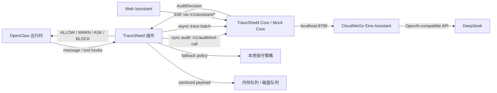

# TraceShield OpenClaw 插件

> **当前文档入口**：先阅读 [项目介绍](PROJECT_OVERVIEW.md)，启动或恢复环境时严格遵循 [完整启动手册](RUNBOOK.md)。模块级 API、契约与方法资料见 [文档索引](doc/README.md)。
>
> 本文件保留早期概览和局部说明以便历史查阅；涉及启动、网络绑定、端口、测试或 OpenClaw 配置时，以 `RUNBOOK.md` 为准。

TraceShield OpenClaw 插件是一个运行时安全门，用来在 OpenClaw 执行工具调用和事件采集时做同步审计、异步留痕、脱敏处理和本地降级。仓库现包含 PostgreSQL 支持的真实 Core，以及由 CloudWeGo Eino 和 DeepSeek 驱动的只读安全助手；`mock-core` 仅保留用于旧的无数据库演示。

当前实现已包含真实 Core、PostgreSQL、方法引擎、Web 控制台、Eino Assistant 和 OpenClaw 插件链路。运行状态应以启动手册中的健康检查、Gateway 日志和自动化测试结果为准。

## 这套项目解决什么问题

- 在 `before_tool_call` 阶段做同步审计，尽量把高风险操作拦在执行前。
- 采集消息、模型输入输出、工具调用和工具结果，并异步上报给 Core。
- 对敏感内容做摘要、脱敏和哈希，避免把完整原文直接写入事件载荷。
- 当 Core 不可用时，自动切换到保守的本地降级策略。
- 对破坏性 shell 命令请求 OpenClaw 人工确认；无审批路由或超时时默认拒绝。
- 提供 `traceshield_status` 工具，便于在 OpenClaw 中快速确认插件状态。
- 在 Web 的 `/assistant` 页面以 SSE 流式调用 Eino + DeepSeek，对已脱敏的审计摘要做只读解释和调查辅助。

## 项目结构

```text
traceshield/
├─ assistant-eino/    # CloudWeGo Eino + DeepSeek 对话服务
├─ core/              # Fastify + PostgreSQL 审计服务
├─ web/               # Vue 控制台与 /assistant 对话界面
├─ openclaw-plugin/   # TraceShield OpenClaw 插件本体
├─ mock-core/         # 仅用于旧演示的模拟服务
├─ deploy/systemd/    # 本项目用户级 systemd 服务单元
├─ doc/               # 开发日志与阶段性记录
├─ docker-compose.yml # PostgreSQL 16
└─ README.md
```

### openclaw-plugin

插件主体位于 `openclaw-plugin/`，核心能力包括：

- OpenClaw 插件入口与注册逻辑
- 消息、工具调用、工具结果的规范化
- 同步审计客户端和异步事件上报客户端
- 内存队列、磁盘队列和 flush worker
- 脱敏、摘要、哈希和降级策略
- 类型、测试和插件契约文档

### core

`core/` 是默认联调服务，提供 PostgreSQL 持久化、同步策略决策、异步事件提取、前端查询 API 和 SSE 实时流。Core v2 通过长期 Python JSONL Worker 运行论文方法核心，支持 `legacy`、`shadow`、`enforce` 三种模式，并保留故障时的旧策略回退。完整接口见 [Core API](core/docs/api.md)。

方法核心和来源基线位于 `core/method-engine/`，Runtime Worker 不开放额外网络端口。

### assistant-eino

`assistant-eino/` 是 Web 安全助手的独立 Go 服务。它通过 CloudWeGo Eino 的 `ChatModel` 接口和 Eino OpenAI 扩展调用 DeepSeek 的 OpenAI 兼容接口，默认仅监听 `127.0.0.1:8790`。浏览器不直连该端口，而是通过 Core 的 `/v1/assistant/*` 代理访问。

当前阶段只接入了流式对话，没有注册工具，也不改变 Core 的策略决策或执行结果。详细构建、启动和验证命令见 [完整启动手册](RUNBOOK.md)，服务自身的环境变量与接口见 [Assistant README](assistant-eino/README.md)。

### mock-core

`mock-core/` 是一个无数据库的旧演示服务，仅支持：

- `POST /v1/audit/tool-call`
- `POST /v1/events/batch`

它会基于请求内容返回模拟的 `ALLOW`、`WARN`、`ASK` 或 `BLOCK` 决策，方便本地演示和联调。

## 架构概览



## 快速开始

### 1. 启动 PostgreSQL 和 Core

```bash
docker compose up -d postgres

cd core
npm install
cp .env.example .env
npm run db:migrate
npm run dev
```

Core 默认监听 `0.0.0.0:8787`；端口可通过 `TRACESHIELD_CORE_PORT` 配置。`MOCK_CORE_PORT` 仅用于旧的 `mock-core`。

### 2. 构建并启动 Eino Assistant

将测试用 DeepSeek API key 放在仓库根目录的 `api-key` 文件后，在另一个以仓库根目录为工作目录的终端执行：

```bash
cd assistant-eino
go test ./...
mkdir -p bin
go build -o bin/traceshield-assistant ./cmd/server
TRACESHIELD_ASSISTANT_API_KEY_FILE="$PWD/../api-key" ./bin/traceshield-assistant
```

Assistant 默认监听 `127.0.0.1:8790`。日常运行推荐使用仓库提供的用户级 systemd 服务；完整安装、健康检查、停止和故障定位命令见 [完整启动手册](RUNBOOK.md)。

### 3. 构建插件

```bash
cd openclaw-plugin
npm install
npm run build
```

构建产物会输出到 `dist/`。

### 4. 让 OpenClaw 加载插件

把 `openclaw.plugin.json` 的入口指向构建后的 `dist/index.js`，然后在 OpenClaw 环境里加载该插件。

插件会在启动时注册：

- `traceshield_status` 工具
- 事件采集 hook
- `before_tool_call` 同步审计
- `after_tool_call` 异步留痕
- `before_prompt_build` 安全提示
- `agentToolResultMiddleware` 可见阻断反馈

### 5. 运行演示脚本

```bash
cd openclaw-plugin
npm run demo:openclaw
```

这个脚本会展示插件 ID、版本、Hook 注册情况、队列状态，以及不同工具调用的审计结果。

注意：`demo:openclaw` 是模拟/本地链路演示，不等于真实 OpenClaw Gateway 加载验证。真实链路的启动、日志检查和健康验证见 [完整启动手册](RUNBOOK.md)。

## 配置

### core

- `TRACESHIELD_DATABASE_URL`: PostgreSQL 连接串。
- `TRACESHIELD_CORE_PORT`: Core 监听端口，默认 `8787`。
- `TRACESHIELD_ASSISTANT_BASE_URL`: Eino Assistant 地址，默认 `http://127.0.0.1:8790`。
- `TRACESHIELD_ASSISTANT_TIMEOUT_MS`: Core 等待 Assistant 流的超时，默认 `60000` 毫秒。
- `TRACESHIELD_SAVE_RAW_PAYLOAD/PARAMS/RESULT`: raw 数据调试开关，默认均为 `false`。

### assistant-eino

- `TRACESHIELD_ASSISTANT_API_KEY_FILE`: DeepSeek API key 文件路径；仓库服务单元默认读取根目录 `api-key`。
- `TRACESHIELD_ASSISTANT_BASE_URL`: 模型接口地址，默认 `https://api.deepseek.com`。
- `TRACESHIELD_ASSISTANT_MODEL`: 模型名称，服务单元默认使用 `deepseek-v4-flash`。
- `TRACESHIELD_ASSISTANT_HOST` / `TRACESHIELD_ASSISTANT_PORT`: 监听地址与端口，默认 `127.0.0.1:8790`。
- `TRACESHIELD_ASSISTANT_THINKING_ENABLED`: 是否启用模型思考模式，演示环境默认关闭以缩短等待时间。

完整限制项和优先级见 [`assistant-eino/.env.example`](assistant-eino/.env.example)。

### mock-core（旧演示）

- `MOCK_CORE_PORT`: Mock Core 监听端口，默认 `8787`。

### openclaw-plugin

插件支持的主要配置如下：

| 配置项 | 默认值 | 说明 |
| --- | --- | --- |
| `plugin_id` | `traceshield-security-plugin` | 插件 ID。 |
| `gateway_id` | 无 | 可选网关或宿主实例 ID。 |
| `core_base_url` | `http://127.0.0.1:8787` | Core 或 Mock Core 地址。 |
| `audit_timeout_ms` | `400` | `before_tool_call` 同步审计超时。 |
| `event_flush_timeout_ms` | `1000` | 异步事件上报超时。 |
| `event_flush_interval_ms` | `2000` | 异步事件批量上报间隔。 |
| `mode` | `development` | `development` / `demo` / `production`。 |
| `fallback_enabled` | `true` | Core 不可用时是否启用本地保守策略。 |
| `debug_full_payload` | `false` | 是否允许上传完整载荷，仅用于本地调试。 |
| `disk_queue_dir` | `.traceshield/events` | 磁盘队列目录。 |
| `memory_queue_max_events` | `1000` | 内存队列最大事件数。 |
| `local_allow_tool_kinds` | `file_read` | Core 故障时允许直接放行的只读工具类别。 |
| `high_risk_tool_kinds` | 见源码默认值 | Core 故障时默认 fail-closed 的高风险工具类别。 |

可通过 `openclaw.plugin.json`、OpenClaw 配置源或环境变量覆盖运行参数。配置优先级为：OpenClaw plugin config source → 环境变量 → 默认值。当前代码支持的环境变量包括：

- `TRACESHIELD_PLUGIN_ID`
- `TRACESHIELD_GATEWAY_ID`
- `TRACESHIELD_CORE_BASE_URL`
- `TRACESHIELD_AUDIT_TIMEOUT_MS`
- `TRACESHIELD_EVENT_FLUSH_TIMEOUT_MS`
- `TRACESHIELD_EVENT_FLUSH_INTERVAL_MS`
- `TRACESHIELD_DISK_QUEUE_DIR`
- `TRACESHIELD_MEMORY_QUEUE_MAX_EVENTS`
- `TRACESHIELD_LOCAL_ALLOW_TOOL_KINDS`
- `TRACESHIELD_HIGH_RISK_TOOL_KINDS`
- `TRACESHIELD_MODE`
- `TRACESHIELD_FALLBACK_ENABLED`
- `TRACESHIELD_DEBUG_FULL_PAYLOAD`

列表类环境变量使用英文逗号分隔，例如：

```bash
TRACESHIELD_LOCAL_ALLOW_TOOL_KINDS=file_read,read_only
TRACESHIELD_HIGH_RISK_TOOL_KINDS=shell_exec,file_write,file_delete,network_request
```

## 核心能力

### 同步审计

`before_tool_call` 会把工具名称、工具类别、原始参数摘要和上下文发送给 Core。Core 返回的决策会被映射成 OpenClaw 可执行的放行、阻断、审批或参数改写结果。

`rm -rf`、`mkfs`、`dd if=` 等破坏性命令默认返回 `ASK critical`；有审批 UI/频道时由用户确认，无审批路由或超时时拒绝。敏感文件读取仍直接 `BLOCK`。

### 异步留痕

消息、模型输入输出、工具结果和降级决策都会进入 TraceEvent 流，并通过内存队列和磁盘队列异步补传。

### 脱敏与最小采集

项目默认不保存完整敏感原文，而是尽量保留：

- `preview`
- `hash`
- `summary`
- 必要的资源提示

### 本地降级

当 Core 超时、网络失败或返回不可解析内容时，插件会切换到保守策略：

- 高风险工具默认阻断
- 低风险只读工具优先依赖本地 allow cache
- 未知工具默认请求确认或阻断
- 每次降级都会生成 `fallback_decision` 事件

## 开发与验证

在 `openclaw-plugin/` 下可运行：

```bash
npm run format
npm run format:check
npm run typecheck
npm run test
npm run build
```

在 `mock-core/` 下可运行：

```bash
npm run typecheck
npm run dev
```

在 `assistant-eino/` 下可运行：

```bash
go test ./...
mkdir -p bin
go build -o bin/traceshield-assistant ./cmd/server
```

项目文档记录的当前验证结果是：类型检查、测试和构建都已通过。

## 参考文档

- [插件契约](openclaw-plugin/docs/plugin-contract.md)
- [事件结构](openclaw-plugin/docs/event-schema.md)
- [决策结构](openclaw-plugin/docs/decision-schema.md)
- [演示脚本](openclaw-plugin/docs/demo-script.md)
- [项目文档索引](doc/README.md)
- [Eino Assistant](assistant-eino/README.md)

## 适合继续做什么

1. 把 `mock-core` 升级成更完整的审计服务。
2. 补充更多真实 OpenClaw 手工验证记录，例如 `traceshield_status` 工具 UI 调用截图或日志。
3. 将真实 TraceShield Core 接入当前插件配置。
