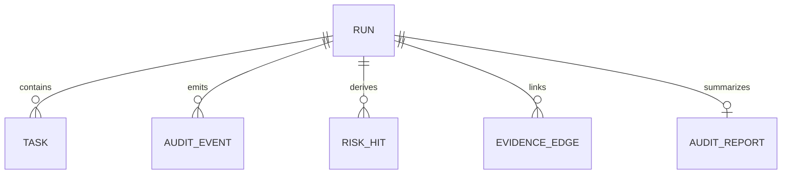

# Data Models (Round 10)

## Core Entities

- `Run`: run-level lifecycle and final risk/disposition.
- `Task`: original user input bound to run.
- `AuditEvent`: normalized event stream for semantic/policy/execution stages.
- `RiskHit`: persisted risk-chain findings per run.
- `EvidenceEdge`: graph relationship edges for report graph view.
- `AuditReport`: aggregated report snapshot data.

## Relationship Summary

## Design Notes

- `AuditEvent` is the canonical timeline source for report/timeline/graph builders.
- Final UI state is derived from persisted run/report data; no cross-request mutable cache.
- Standard demo scenarios do not introduce new entities; they reuse the same run/event/report pipeline.
