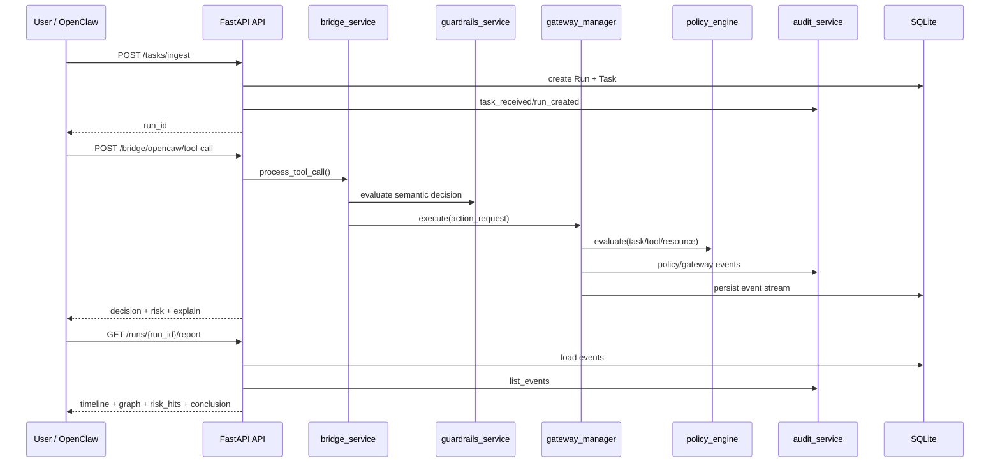
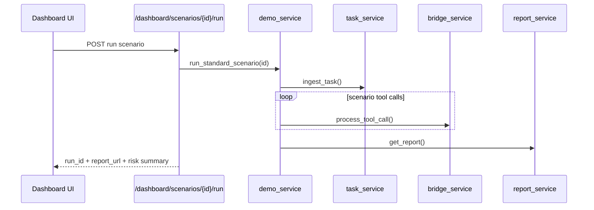

# Core Sequence (Round 10)

## Runtime Flow (Tool Call)

```mermaid
sequenceDiagram
    participant U as User / OpenClaw
    participant API as FastAPI API
    participant BR as bridge_service
    participant GR as guardrails_service
    participant GW as gateway_manager
    participant PE as policy_engine
    participant AU as audit_service
    participant DB as SQLite

    U->>API: POST /tasks/ingest
    API->>DB: create Run + Task
    API->>AU: task_received/run_created
    API-->>U: run_id

    U->>API: POST /bridge/opencaw/tool-call
    API->>BR: process_tool_call()
    BR->>GR: evaluate semantic decision
    BR->>GW: execute(action_request)
    GW->>PE: evaluate(task/tool/resource)
    GW->>AU: policy/gateway events
    GW->>DB: persist event stream
    API-->>U: decision + risk + explain

    U->>API: GET /runs/{run_id}/report
    API->>DB: load events
    API->>AU: list_events
    API-->>U: timeline + graph + risk_hits + conclusion
```

## One-Click Demo Scenario Flow

```mermaid
sequenceDiagram
    participant UI as Dashboard UI
    participant API as /dashboard/scenarios/{id}/run
    participant DS as demo_service
    participant TS as task_service
    participant BS as bridge_service
    participant RS as report_service

    UI->>API: POST run scenario
    API->>DS: run_standard_scenario(id)
    DS->>TS: ingest_task()
    loop scenario tool calls
      DS->>BS: process_tool_call()
    end
    DS->>RS: get_report()
    API-->>UI: run_id + report_url + risk summary
```
